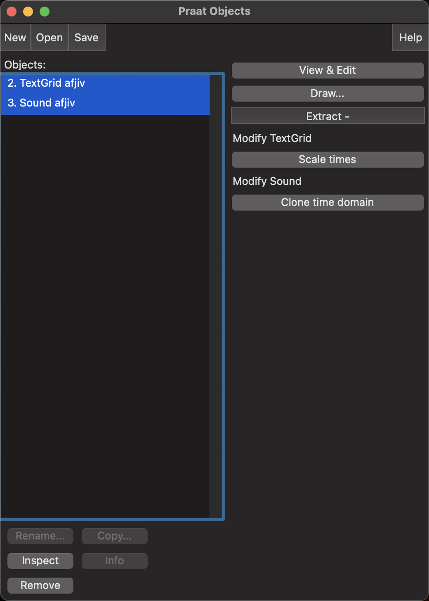
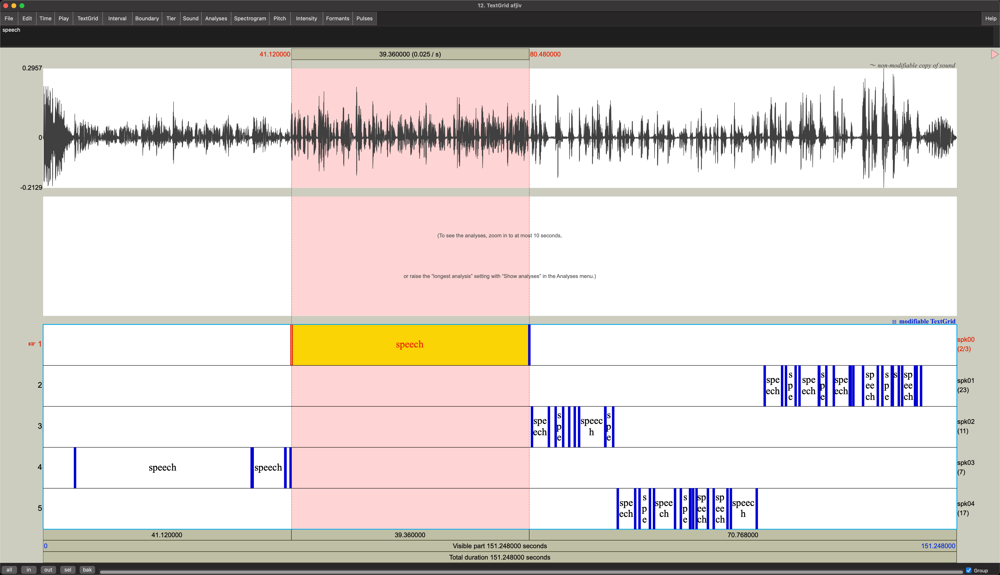
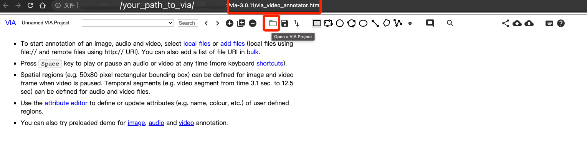
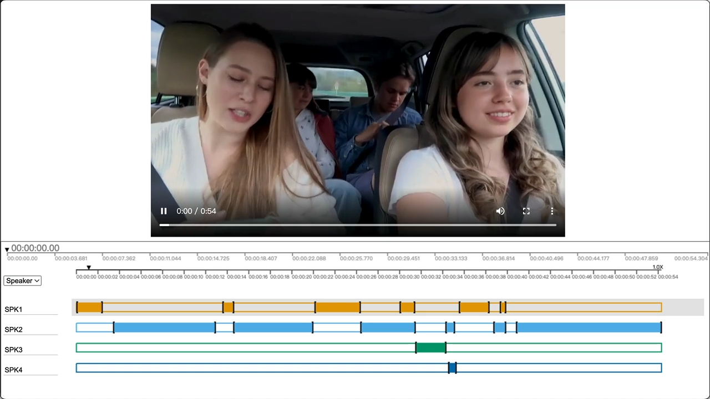
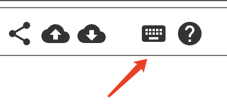

# Visualization Tools for Speaker Diarization
## Introduction

There lacks a diarization visualization tool that is essential for analyzing dataset or algorithm results. In this repo, we provide convenient ways to visualize speaker diarization results. One criterion for choosing this visualization software is to support interactive operation. Although those visualization tools could be better, we can not find a better replacement.


## Visualization for Audio-only datasets

### Step 1: Generating praat format:

```
python audio_visualized.py -rttm audio_cases/afjiv.rttm -audio_path audio_cases/afjiv.wav -praat_result audio_cases/afjiv.txt
```

* ``rttm`` --- the reference or system rttm 
* ``audio_path`` --- the audio path
* ``praat_result`` --- visualized result for praat software

(Example is from [VoxConverse](https://github.com/joonson/voxconverse))

### Step 2: Import ``praat_result`` into Praat:
- Install Praat [Mac](https://www.fon.hum.uva.nl/praat/download_mac.html) or [Windows](https://www.fon.hum.uva.nl/praat/download_win.html)
- import ``praat_result`` into Praat 
    - Open ``praat_result`` and ``audio``
    - 
    - Select them all
    - Click ``View & Edit``

### Step3: Overview



You can slide with horizontal scroll. Speaker labels are shown in each timeline (e.g., ``spk00``, ``spk01`` ...).

Some usefull shortcuts:

- ``CMD + A``: Show all utterances in one screen.
- ``CMD + N``: Dive into selected areas.

## Visualization for Audio-visual datasets

### Step 1: Generating VIA format

```
python audio_visual_visualized.py -rttm audio_visual_cases/00115.rttm -mp4_path audio_visual_cases/00115.rttm -via_json_result audio_visual_cases/00115.json
```

* ``rttm`` --- the reference or system rttm 
* ``mp4_path`` --- the mp4 path
* ``via_json_result`` --- visualized result for VIA software

(Example is from [MSDWild](https://github.com/X-LANCE/MSDWILD))

> If the video cannot be previewed or quickly previewed, please try to convert them to support specific mp4 format of HTML5.
> ```
> ffmpeg -i original.mp4 -vcodec libx264 -acodec aac -preset fast -movflags +faststart  previewed.mp4
> ```

### Step 2: Import ``via_format.json`` into VIA tools

- Download ``via_video_annotator.html`` from [URL](https://www.robots.ox.ac.uk/~vgg/software/via/downloads/via3/via-3.0.11.zip) or directly use a [online demo](https://www.robots.ox.ac.uk/~vgg/software/via/demo/via_video_annotator.html). This website is a offline client and we have tested on version ``via-3.0.11``(also see file: ``via_video_annotator_3.0.11.html`` in this repo).
- Import json by clicking the ``folder button`` as follows:
- You can also modify the script to support online URL from OSS (Object Storage Service).

### Step3: Overview



You can use `Space` key to control `Play/Pause Media`.

More keys can be found on:

 
 

References
=========
- https://www.fon.hum.uva.nl/praat/
- https://www.robots.ox.ac.uk/~vgg/software/via/